Este proyecto es una aplicación REST dividida en distintos ejercicios del curso de  Spring de Opent Bootcamp

## Ejercicio 2

Crear un proyecto Spring Boot con las dependencias:

Starters para persistencia:

H2

Spring Data JPA

Starters para web:

Spring Web

Spring Boot dev tools

Crear una clase HelloController que sea un controlador REST. Dentro de la clase crear un método que retorne un saludo. Probar que retorna el saludo desde el navegador y desde Postman.

Desde navegador

Desde Insomnia (alternativa a postman)

## Ejercicio 3

Dentro de la misma app crear las clases necesarias para trabajar con "ordenadores":

Laptop (entidad)

LaptopRepository (repositorio)

LaptopController (controlador)

Desde LaptopController crear un método que devuelva una lista de objetos Laptop.

Probar que funciona desde Postman.

Los objetos Laptop se pueden insertar desde el método main de la clase principal.

Creando dos objetos desde el main, obtenemos la siguiente response en insomnia

## Ejercicio 4

Crear un método en LaptopController que reciba un objeto Laptop enviado en formato JSON desde Postman y persistirlo en la base de datos.

Comprobar que al obtener de nuevo los laptops aparece el nuevo ordenador creado.

Utilizamos el endpoint para guardar una laptop

Comprobamos que al consultar los registros nos devuelve también el último que registramos

## Ejercicio 5

Implementar los métodos CRUD en el API REST de Laptop creada en ejercicios anteriores.
Para este ejercicio se implementaron diferentes criterios de acuerdo a los mostrado en las clases

Los métodos CRUD:

findAll()

findOneById()

create()

update()

delete()

deleteAll()

## Ejercicio 6

Implementar swagger sobre el API REST de Laptop y verificar que funciona en la URL: http://localhost:8081/swagger-ui/

Para este proyecto decidí implementar la nueva version de Swagger 3. Lo hice con
la dependecia de spring-doc-openapi en vez de utilizar el sugerido que es spring-fox

Por lo tanto el archivo de configuración es un poco diferente, ya que en lugar de usar la
clase Docket implementamos una instancia de OpenAPI.

Y el resultado en http://localhost:8081/swagger-ui/index.html#/ es el siguiente

## Ejercicio 7

Crear casos de test para el controlador de Laptop desde Spring Boot. 
Con click derecho dentro del código de la clase LaptopController utilizar la 
opción Generate > Test para crear la clase con todos los tests unitarios e 
implementarlos siguiente el proceso visto en clase.

## Ejercicio 10

Probar a empaquetar la aplicación con maven package desde Intellij IDEA

Desde terminal en Intellij IDEA verificar que se se ejecuta correctamente con el comando:
java -jar target/spring-deploy-1.0.jar
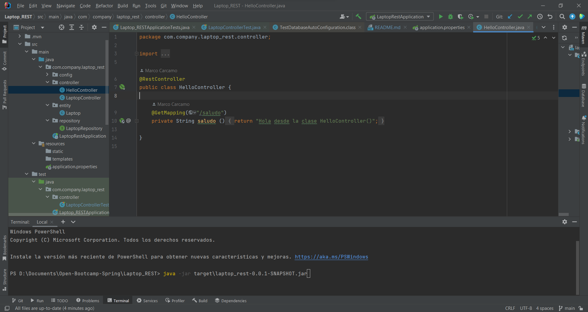

Vemos que la aplicación inicia correctamente desde el .jar

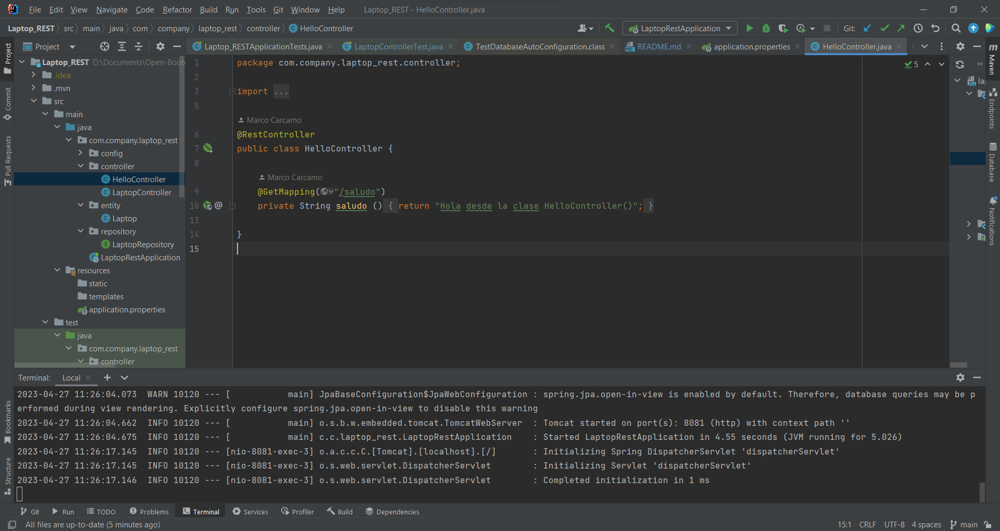

Y se hace correctamente la petición desde insomnia

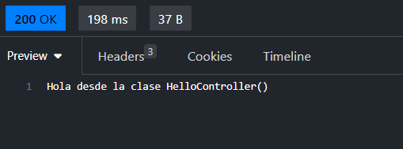

Crear un perfil para dev y otro para test con una propiedad nueva que carguemos en el controlador.

Aquí tenemos los perfiles
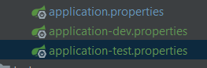

y aquí tenemos el controlador con el mensaje que se manda desde el perfil dev.

Para cargar la propiedad definida en ell archivo properties, es necesario usar la anotación Value y
pasarle el valor dentro de ${}
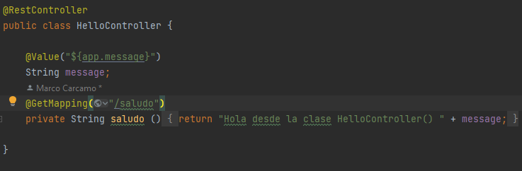

Al realizar la petición se devuelve correctamente el mensaje y el perfil especificado

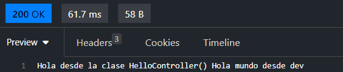

## Ejercicio 11

Desplegar el API REST de Laptops en Heroku y verificar funcionamiento desde POSTMAN.

A la fecha en que realizo este ejercicio Heroku a dejado de tener planes gratuitos por lo que, en su lugar, haré el despliege de
la aplicación a azure y veremos si funcionan correctamente todas las peticiones. El despliegue en esta plataforma tampoco es 
gratuito pero cuento con créditos disponibles para hacer pruebas.

Para realizar el despliegué utilizaré el Toolkit disponible es IntelliJ
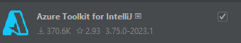

Y el recurso en Azure será Azure Spring Apps

Información básica y creamos el recurso
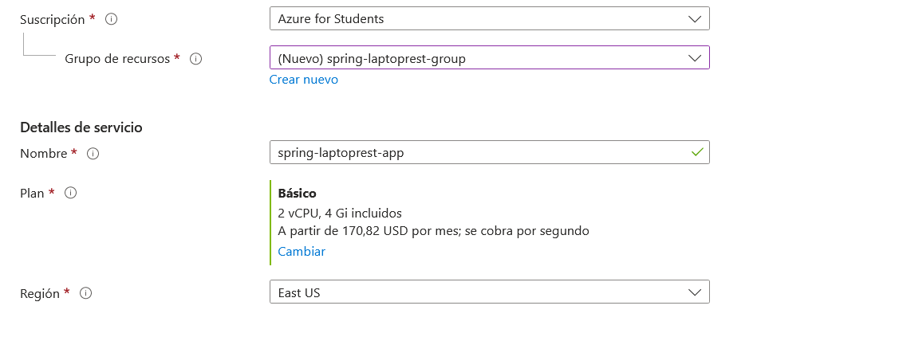

y así se ve el recurso en funcionamiento

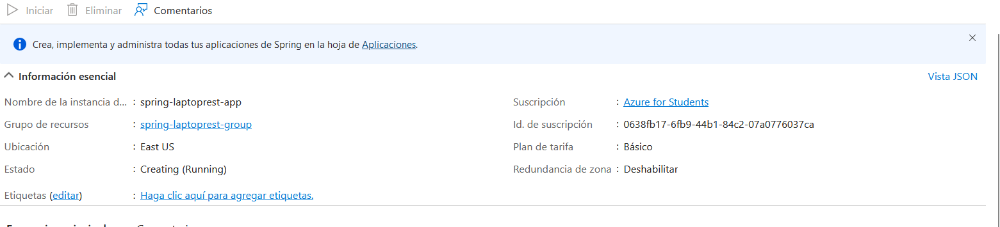

Una vez que se ha creado nuestro recurso vamos a Tools -> Azure -> Sign In
Aquí habrá que loguearnos con nuestra cuenta de Azure para que el complemento pueda localizar nuestros recursos

Luego podemos hacer lo mismo pero esta vez vamos a Tools -> Azure -> Deploy to Azure Spring Apps

Configuramos el despliegue, damos click a Apply y luego a Run, nuestra aplicación comenzará a desplegarse

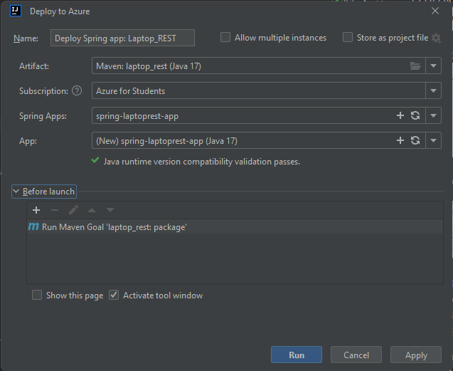

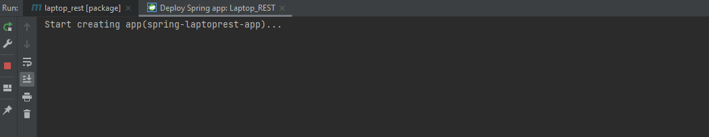

Si todo ha salido bien, tendremos aviso de que la aplicación ha sido desplegada
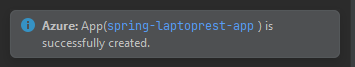

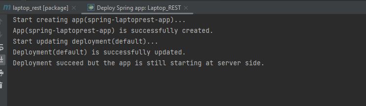

Ahora podemos probrla en Azure

Localizamos nuevamente nuestro recurso y vamos a la sección de Aplicaciones
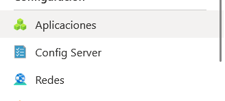

Aquí podremos ver las aplicaciones que tenemos desplegadas

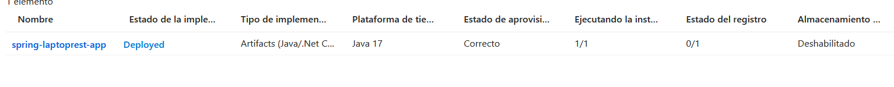

Seleccionamos y vemos que se nos ha asignado una url a nuestra aplicacion 

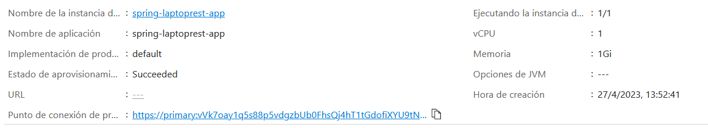

Si entramos vemos que la aplicación está corriendo, no aparece nada ya que no tenemos nada configurado en la ruta principal, pero
podemos ver que es el mensaje típico de las aplicaciones de Spring. Con el enlace que nos proporciona Azure, ya podemos
probar en postman o en insomnia.

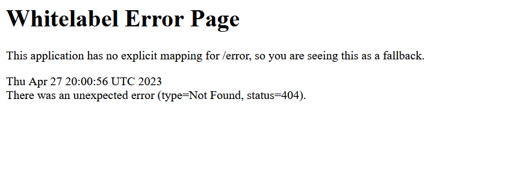

probamos el endpoint más simple que es el de saludo

Y la aplicación está corriendo a la perfección

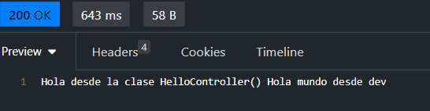

También podemos comprobarlo en el navegador

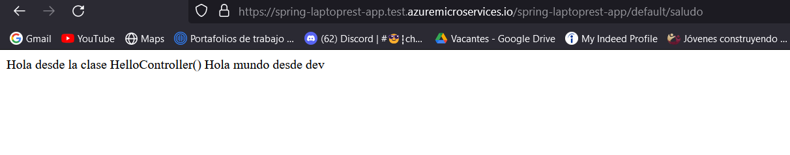

Podemos probar los otros endpoints

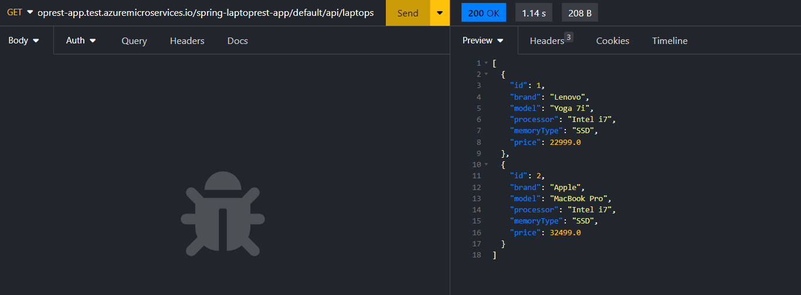

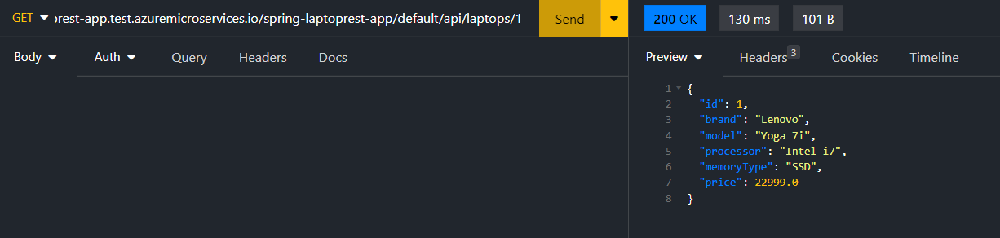

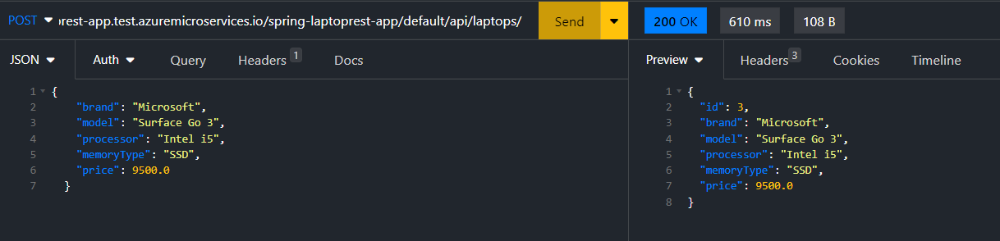

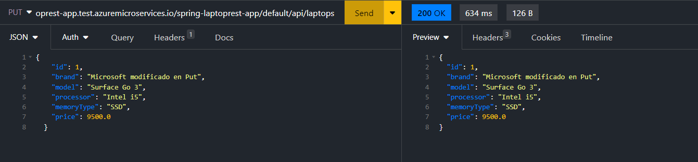

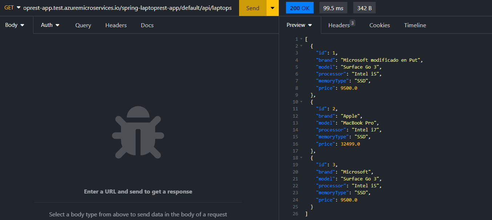

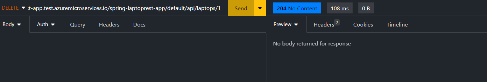

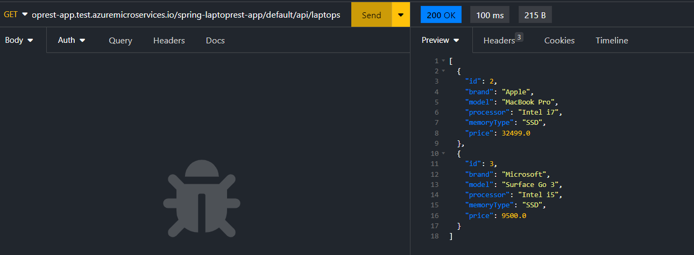

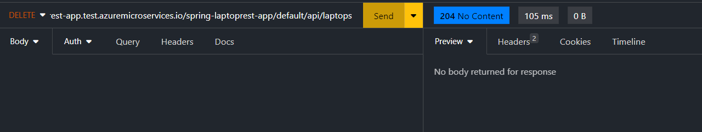

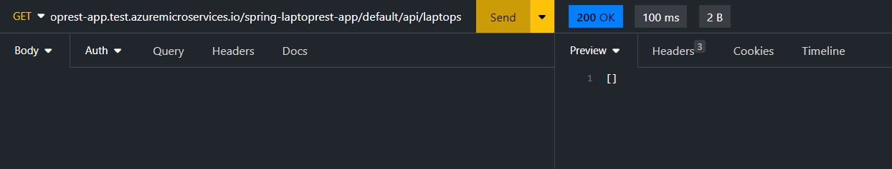

Todas las peticiones Rest han funcionado perfectamente en nuestro despliegue a Azure. Ahora solo queda borrar todos los recursos
de Azure.

Recursos consultados para despliegue

https://www.campusmvp.es/recursos/post/tutorial-como-desplegar-tu-aplicacion-spring-boot-a-azure-paso-a-paso.aspx

https://learn.microsoft.com/es-es/azure/spring-apps/how-to-intellij-deploy-apps

## Ejercicio 12

Añadir Spring Security sobre el proyecto API REST de Laptops y configurar 2 usuarios en memoria utilizando una clase WebSecurityConfig.

Se configuró /saludo, que está permitida sin autorizaicón y /api/laptops que requiere autorización de ADMIN

Sin acceso con el usuario user
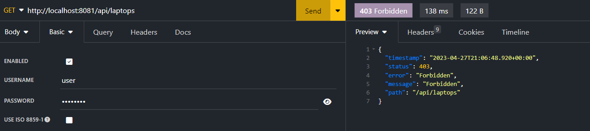

Con acceso con el usuario admin

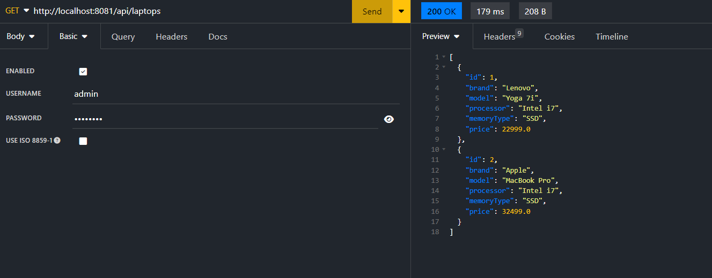