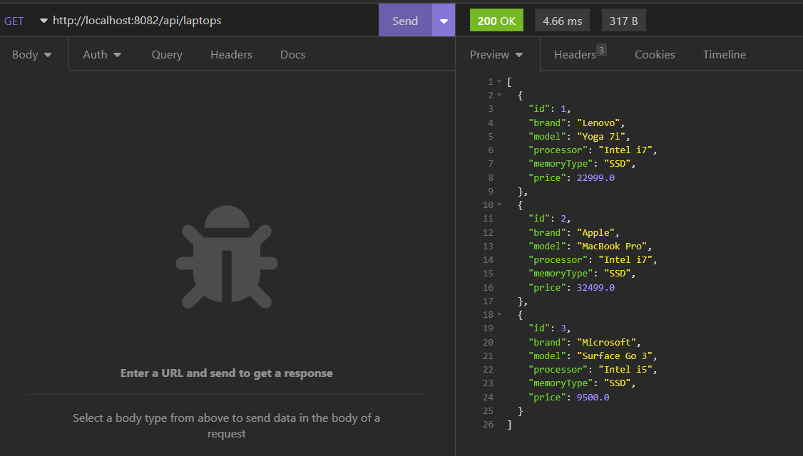

Este proyecto es una aplicación REST dividida en distintos ejercicios del curso de  Spring de Opent Bootcamp

## Ejercicio 2

Crear un proyecto Spring Boot con las dependencias:

Starters para persistencia:

H2

Spring Data JPA

Starters para web:

Spring Web

Spring Boot dev tools

Crear una clase HelloController que sea un controlador REST. Dentro de la clase crear un método que retorne un saludo. Probar que retorna el saludo desde el navegador y desde Postman.

Desde navegador

Desde Insomnia (alternativa a postman)

## Ejercicio 3

Dentro de la misma app crear las clases necesarias para trabajar con "ordenadores":

Laptop (entidad)

LaptopRepository (repositorio)

LaptopController (controlador)

Desde LaptopController crear un método que devuelva una lista de objetos Laptop.

Probar que funciona desde Postman.

Los objetos Laptop se pueden insertar desde el método main de la clase principal.

Creando dos objetos desde el main, obtenemos la siguiente response en insomnia

## Ejercicio 4

Crear un método en LaptopController que reciba un objeto Laptop enviado en formato JSON desde Postman y persistirlo en la base de datos.

Comprobar que al obtener de nuevo los laptops aparece el nuevo ordenador creado.

Utilizamos el endpoint para guardar una laptop

Comprobamos que al consultar los registros nos devuelve también el último que registramos

## Ejercicio 5

Implementar los métodos CRUD en el API REST de Laptop creada en ejercicios anteriores.
Para este ejercicio se implementaron diferentes criterios de acuerdo a los mostrado en las clases

Los métodos CRUD:

findAll()

findOneById()

create()

update()

delete()

deleteAll()

## Ejercicio 6

Implementar swagger sobre el API REST de Laptop y verificar que funciona en la URL: http://localhost:8081/swagger-ui/

Para este proyecto decidí implementar la nueva version de Swagger 3. Lo hice con
la dependecia de spring-doc-openapi en vez de utilizar el sugerido que es spring-fox

Por lo tanto el archivo de configuración es un poco diferente, ya que en lugar de usar la
clase Docket implementamos una instancia de OpenAPI.

Y el resultado en http://localhost:8081/swagger-ui/index.html#/ es el siguiente

## Ejercicio 7

Crear casos de test para el controlador de Laptop desde Spring Boot. 
Con click derecho dentro del código de la clase LaptopController utilizar la 
opción Generate > Test para crear la clase con todos los tests unitarios e 
implementarlos siguiente el proceso visto en clase.