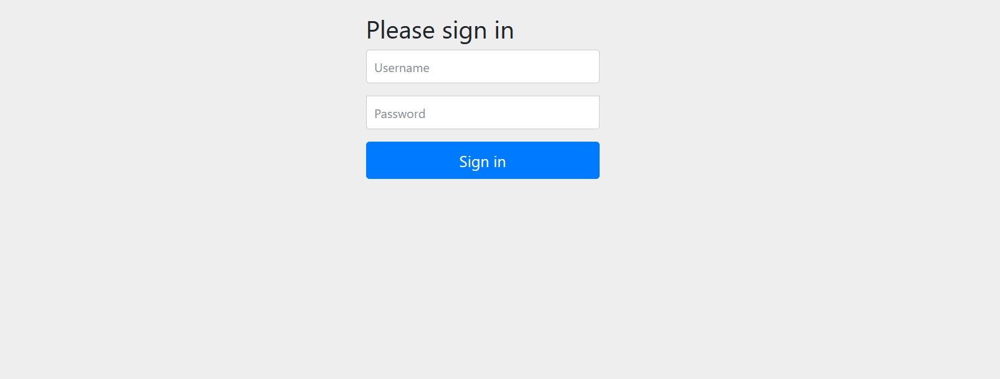

### Spring security

Creamos un proyecto añadiendo la dependencia de Spring Security

Esta dependencia de forma automática nos genera una contraseña que podemos ver en la consola también genera un usuario por defecto que es user, e interceptara cualquier petición
que hagamos a nuestra API.

Como vemos a continuación, al tratar de acceder a la aplicación se nos muestra
un formulatio de autenticación.

Si intentamos hacer esta petición en insomnia nos arroja que es una petición no autorizada con
estatus 401

Para poder loguearnos, debemos buscar el apartado de autorización en insomina postman,
dependiendo de la herramienta que utilicemos.

Tendremos disponibles diferentes formas de autenticación, para este ejemplo nos basta con
una autenticación básica o basic auth e introducimos nuestras credenciales

Y veremos que esta vez sí hemos realizado la petición de forma exitosa

Este inicio autorizado nos generará una cookie en postman
en Insomnia por otro lado no se genera la cooki cuando se hace
este tipo de autorización

Hay que tener esto en cuenta cuando hagamos pruebas de seguridad, en ocasiones será necesario
borrar las cookies generadas para evitar confusiones, y pensar que nuestras pruebas
funcionan cuando en realidad no es así.

En las clases se sugiere el uso de la clase WebSecurityConfigureAdapter, pero actualmente esta
opción está obsoleta de acuerdo a la documentación oficial, en vez de eso se recomienda el uso del bean
SecurityFilterChain y webSecurityCustomizer

Esta nueva forma de configuración puede encontrarse en este enlace
[https://spring.io/blog/2022/02/21/spring-security-without-the-websecurityconfigureradapter
]()
https://docs.spring.io/spring-security/reference/servlet/configuration/java.html

https://stackoverflow.com/questions/74609057/how-to-fix-spring-authorizerequests-is-deprecated

## Configuración de un usuario y contraseña

La forma más sencilla de personalizar nuestro usuario y contraseña es modificándolo directamente
a través del archivo application.properies

De igual forma en las clases se utiliza la creación de usuarios
con la clase AuthenticationManagerBuilder, pero ahora se sugiere
utilizar UserDetailService

Actualización de las clases para configurar el encoder

https://www.baeldung.com/spring-security-5-default-password-encoder

Nuestra configuración de usarios queda así

Pruebas con usuarios

De acuerdo a nuestra configuración, deberíamos poder
acceder a 
- /hola sin ninguna autenticacion

- / bootstrap con rol de administrador, el rol user nos debe devolver no autorizado

## Firewall
Spring Security tiene un firewall con una onfiguración por defecto,
lo normal es dejarlo así, pero si se quiere personalizar puede hacerse
utilizando la clase HttpFirewall para que no lance expcepciones
con determinadas peticiones.

